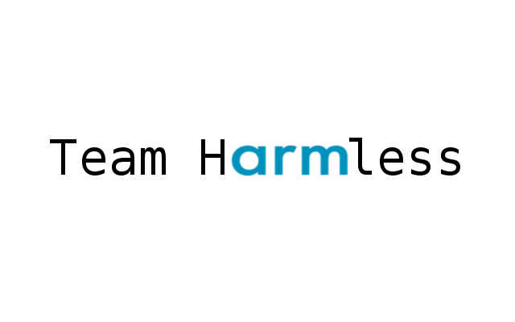

# UNICEF-Project
## Overview
This is an application made for UNICEF in the arm intern competition 2018! The application is designed to allow a user to input
files describing a set of schools and hospitals (in a set format) from anywhere over the world, and then quickly be able to search
and extract important data that will help plan for development to make children safer and get the education they deserve.

## Our take
Although we had access to shapefiles, we thought that displaying a map was not that important, what really matters is ease of use and
ability to get and visualise the data that you are looking for. For this reason, we have decided that our innovation is to display the
data as a graph, much like the London tube map. The map will be interactive and can represent more than just paths between places. We propose
3 different modes
* Straight line distance mode
* Road distance mode
* Travel time distance mode

## How to install
1. Clone this project (the master branch _should_ always work) and download QT from [here](https://www.qt.io/download)
2. When installing QT, be sure to use the newest version!
3. Open the project, a message about versions may come up, ignore it.
4. Hit run!

If you want to use it on a platform without QT Creator, follow [these](http://doc.qt.io/qt-5/deployment.html) instructions on deploying a QT app.
Although untested, the app should run on Android and iOS without modification.

## How to use
You can watch a video that demos the software, as well as talks in a little detail
about it's implementation [here](https://youtu.be/vnm1T06-cK4)
## Test Coverage
As there has only been 2-3 active member on this project, we have only had the chance
to test on Linux. Please share your findings and fixes on other platforms! We imagine
MS Windows could be problematic.

## Progress
- [x] Parse JSON files
- [x] Search Schools and health facilities by name
- [x] Search UI
- [x] Search schools and facilities by location
- [x] General UI
- [x] QML renderer of graph
- [x] ~~Google~~ Bing map integration

